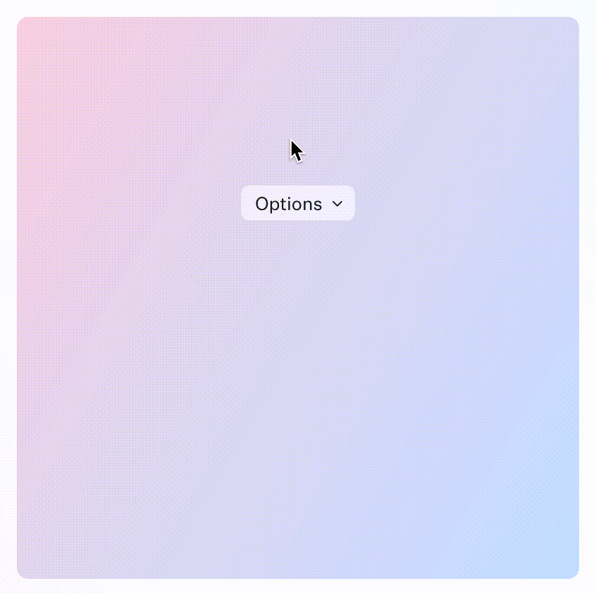

# 前端实习面试题

## 题目

使用 react 设计并实现 [demo.gif](./demo.gif) 演示的组件

- 优先使用 `FunctionCompnent` 实现, 如果需要使用 `ClassComponent` 请说明原因
- 样式方案不限, 不要求像素级还原
- 构建方案不限, 能使用 `npm start` 运行即可

## 加分项
- 可读的 Commit Message
- 使用 TypeScript 编写
- 支持键盘操作
- 完成测试用例

## 其他

请在正式面试前使用 Pull Request 提交你的代码